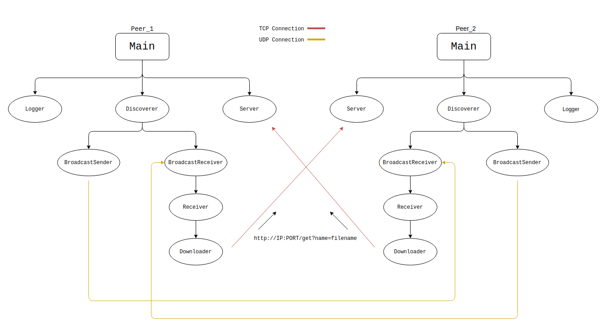

<p align = 'center'>


</p>

---

# NanoSync

NanoSync is a priority-based data sharing java application which lets us share data between multiple nodes simultaneously using NanoHttpd.
Priorities are based on the type of file.

## NanoHttp
NanoHttpd is an open-source, small-footprint web server that is suitable for embedding in applications, written in the Java programming language. The source code consists of a single .java file. It can be used as a library component in developing other software (such as measurement, science and database applications) or as a standalone ad-hoc style HTTP daemon for serving files. [source:wiki]


#### Why Nanohttp?

* Only one Java file, providing HTTP 1.1 support.
* Supports file upload. Uses memory for small uploads, temp files for large ones.
* Supports parameter parsing of GET and POST methods.

**Truth** : My mentor wanted me to use this and I don't know why.

## Requirement
* Java SE 8 (LTS)
* And a PC, keyboard, mouse, wires, energy, air, water, land, sun, galaxy, cosmos ....... and many many many many.... more things. 

## Instructions

1) Create a folder named working.

2) Run jar.
    
    ``` 
    java -jar <JARFILE> <PEER_ID> <ABSOLUTE_PATH_TO_WORKING_FOLDER_WITH_TRAILING_SLASH> <BROADCAST_IP> <PORT except 8080> <MODE(production/development)>
    ```
    
    ``` 
    ex: java -jar nanosync peer_1 /home/lawliet/working/ 198.168.43.255 7777 production
    ```  
3) All shared files will be present in .../working/Sync/ folder.

4) All log files will be present in .../working/Sync/ folder.


## Diagrammatic representation

<p align = 'center'>



</p>

---
* ##### Main : 
    Main module is the entry point of the application.
    This module will start Logger, Discover, Server module.

* ##### Discoverer :
    Discoverer module have two components BROADCAST_SENDER and BROADCAST_LISTNER.
    * **BroadcastSender** : Sends a Broadcast packet after every 5 Seconds.
    * **BroadcastReceiver** : Listens to Broadcast packet and stores the IP address of the nearby devices.

* ##### Logger : 
    Logger module will save all the logs to a CSV.

* ##### Server : 
    Server module will open a http server using nanohttp module and will serve the request.

* ##### Receiver : 
    Receiver module will extract all the file name from the connected peer and also start the downloader module.
* ##### Downloader :
    Downloader module will make a get request to download the file.
---

